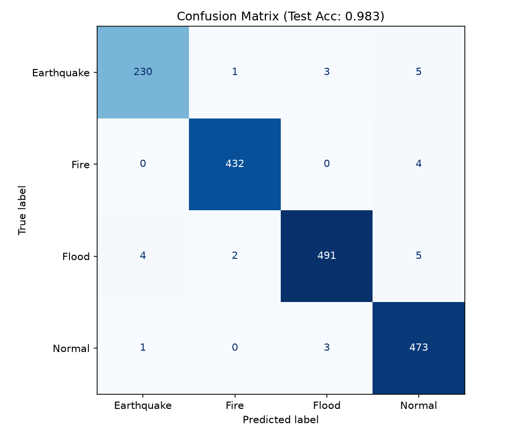
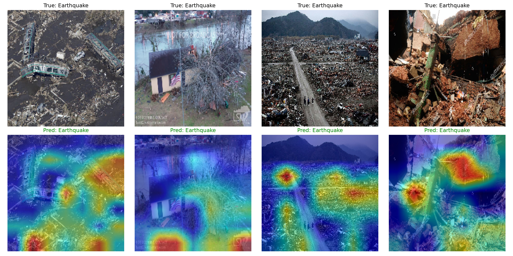

<div align="center">

# 🚁 Aerial Disaster Classifier 🌊🔥

### Real-time disaster recognition from aerial & drone imagery


<em>A deep-learning system that classifies aerial imagery into<br>
<b>Earthquake · Fire · Flood · Normal</b> — with explainable AI to show the <b>why</b> behind every prediction.</em>

</div>

<br>

<div align="center">

| ⚡ Highlight | 📌 Detail |
|:---|:---|
| 🎯 **Accuracy** | **98.31%** on 1,654 unseen test images |
| 🧠 **Model** | ResNet50 (ImageNet) + two-phase transfer learning |
| 🔍 **Explainable** | Grad-CAM heatmaps reveal what the model sees |
| 🖼️ **Dataset** | 16,723 real aerial disaster images (AIDERv2) |
| 💻 **Trained on** | A single laptop GPU — NVIDIA RTX 4060 |
| 🚀 **Demo** | Predicts any image with confidence scores |

</div>

<br>
<hr>

<h2 align="center">📊 &nbsp; Performance</h2>

<div align="center">

<b>Overall Test Accuracy — 98.31%</b><br>
<sub>Measured on 1,654 images the model never saw during training</sub>

<br><br>

| 🏷️ Class | 🎯 Precision | 🔁 Recall | ⚖️ F1-Score | 🖼️ Images |
|:---:|:---:|:---:|:---:|:---:|
| 🟤 **Earthquake** | 0.979 | 0.962 | 0.970 | 239 |
| 🔥 **Fire** | 0.993 | 0.991 | 0.992 | 436 |
| 🌊 **Flood** | 0.988 | 0.978 | 0.983 | 502 |
| 🟢 **Normal** | 0.971 | 0.992 | 0.981 | 477 |
| ⭐ **Macro Avg** | **0.983** | **0.981** | **0.982** | **1654** |

</div>

<br>

<div align="center">

**Confusion Matrix** — correct predictions vs. mistakes



<br><br>

**Grad-CAM Explainability** — red = the pixels that drove each decision



<sub>The model correctly focuses on rubble, water, and smoke — not background artifacts.</sub>

</div>

<br>
<hr>

<h2 align="center">🧠 &nbsp; How It Works</h2>

<div align="center">

| 🔧 Stage | ⚙️ What Happens | 📈 Result |
|:---|:---|:---:|
| **1 · Feature Extraction** | Freeze ResNet50 backbone, train only a new 4-class head | 94.6% val |
| **2 · Fine-Tuning** | Unfreeze deeper blocks (`layer3`, `layer4`) at LR 1e-4 | 97.8% val |
| **3 · Evaluation** | Test on 1,654 unseen images | **98.31%** |

<br>

| 🛡️ Anti-Overfitting Technique | 💡 Purpose |
|:---|:---|
| Data augmentation | Flips, rotations, color jitter → forces general learning |
| Weighted loss | Rare classes (Earthquake) count more during training |
| Best-model checkpointing | Always keep the highest-validation snapshot |
| Low fine-tuning LR (1e-4) | Prevents "catastrophic forgetting" of pretrained knowledge |

</div>

<br>
<hr>

<h2 align="center">🖼️ &nbsp; Dataset</h2>

<div align="center">

| 📦 Property | 📋 Value |
|:---|:---|
| **Source** | [AIDERv2 — Aerial Image Dataset for Emergency Response](https://zenodo.org/records/10891054) |
| **Total images** | 16,723 across 4 classes |
| **Split** | 13,399 Train · 1,670 Validation · 1,654 Test |
| **Note** | Excluded from repo (see `.gitignore`) — download from the source link |

</div>

<br>
<hr>

<h2 align="center">🚀 &nbsp; Quick Start</h2>

**1 · Set up the environment**

```bash
conda create -n flood python=3.11 -y
conda activate flood
pip install torch torchvision --index-url https://download.pytorch.org/whl/cu124
pip install scikit-learn matplotlib pillow grad-cam
```

**2 · Evaluate the model** — prints metrics, saves both figures

```bash
python evaluate.py
```

**3 · Predict on any image**

```bash
python predict.py "path/to/your/image.jpg"
```

<div align="center"><b>Example output</b></div>

```text
PREDICTION: Flood  (100.0% confident)
  Flood       100.0%  #############################
  Earthquake    0.0%
  Normal        0.0%
  Fire          0.0%
```

<br>
<hr>

<h2 align="center">📂 &nbsp; Repository Contents</h2>

<div align="center">

| 📄 File | 🧾 Description |
|:---|:---|
| `evaluate.py` | Loads the model, computes metrics, saves figures |
| `predict.py` | Live demo — classifies any image with confidence scores |
| `make_summary.py` | Generates the results summary document |
| `confusion_matrix.png` | Correct vs. confused predictions |
| `gradcam.png` | Explainability heatmaps |
| `RESULTS_SUMMARY.md` | Full project write-up |

</div>

<br>
<hr>

<h2 align="center">🔍 &nbsp; Key Findings</h2>

<div align="center">

| 🧩 Finding | 📝 Insight |
|:---|:---|
| 🏆 **Best class** | Fire (F1 = 0.992) — smoke & flames are highly distinctive |
| ⚠️ **Weakest class** | Earthquake (recall = 0.962) — wide rubble can look like normal terrain |
| 🔬 **Explainability** | Grad-CAM confirms the model reasons from real disaster features |

</div>

<br>
<hr>

<h2 align="center">🛣️ &nbsp; Future Work</h2>

<div align="center">

| 🚧 Direction | 🎯 Goal |
|:---|:---|
| 🌐 Web demo (Gradio / Streamlit) | Upload an image, see prediction + heatmap live |
| 📊 Model comparison | Benchmark EfficientNet & Vision Transformer |
| 🧬 Segmentation | Pixel-level flood extent & burn-area mapping |
| ❓ Unknown detection | Flag "not a disaster / uncertain" via confidence |
| 📱 Edge deployment | Real-time inference on-drone |

</div>

<br>
<hr>

<div align="center">

<h3>📜 License</h3>

**MIT** — free to use and modify with attribution

<br>

<sub>Built with PyTorch · Trained on an RTX 4060 · Made with 🛠️ and a lot of debugging</sub>

</div>
